# Demonstrations Are Weights

**An interactive artifact about test-time adaptation, built on Pathway's Dragon Hatchling (BDH).**
Three pages, two models we can run, one claim that takes sixty seconds to falsify.

[](https://github.com/snivellus38/DataForge/actions/workflows/tests.yml)
[](https://demonstrations-are-weights.vercel.app)
[](LICENSE)
[](#references-and-tooling)

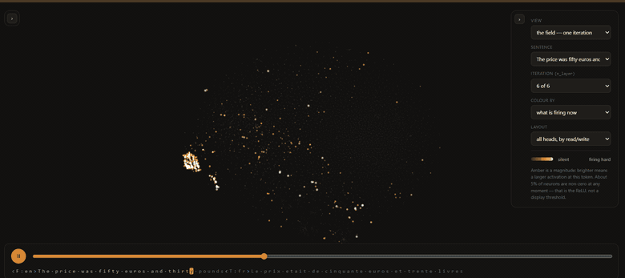

<sup>**THE FIELD.** Every dot is one of the 12,288 neurons in an 8M-parameter BDH we trained,
laid out by its position in the model's own synapse graph. Amber is activation at the current
byte. The clip moves through the views: one iteration, then all six at once, recoloured by
synapse count and by graph community, then back. The dark region is not a rendering artifact —
it is the 38.7% of neurons that the weights alone predict will never fire.</sup>

---

> **Demonstrations are weights you write at inference time.** A frozen model adapts by adding
> rank-one updates to a fixed-size associative state, so changing only the demonstrations changes
> the answer — **but that state's capacity is set by how much its keys overlap, not by its size,
> so the non-negativity that makes BDH inspectable is also what makes it forget sooner.**

Both halves are falsifiable inside the artifact. The first takes about a minute:

1. Open **[THE PRICE](https://demonstrations-are-weights.vercel.app/price.html)**. A 131K-parameter
   BDH runs in your browser tab and answers a substitution cipher it has never seen — the mapping
   exists only in the prompt, resampled fresh for every example.
2. Press **"Remove the demonstration it needs"**. One demonstration disappears; the query bytes
   stay byte-identical.
3. The answer changes from correct at p = 1.000 to **wrong at p = 0.972**, still inside the target
   alphabet. No parameter moved. The model does not hedge when a binding is missing — it is
   confidently wrong and structurally plausible, which is the same failure signature BDH-CQ reports
   in its Table 9.

| | |
|---|---|
| **Artifact** | **https://demonstrations-are-weights.vercel.app** — opens without sign-in |
| **One-page summary** | [`docs/concept-summary.pdf`](docs/concept-summary.pdf) |
| **Defense sheet** | [`docs/defense.md`](docs/defense.md) — every on-screen number mapped to the script that makes it |
| **Run locally** | `npm run dev` → http://localhost:8080 |
| **Tests** | `npm test` — 12 gates, 236 checks, no GPU and no network |

Submitted to **DataForge 2026, Pathway track ("Explain the Frontier")**, on the concept of
**test-time adaptation: optimization versus context**.

## Contents

- [Who this is for](#who-this-is-for)
- [What you are looking at](#what-you-are-looking-at) — the three pages
- [The idea, in three steps](#the-idea-in-three-steps)
- [Where this sits](#where-this-sits) — against Transformers, and what constant memory trades
- [What we measured](#what-we-measured) — six results, each with its script and its caveat
- [The two models](#the-two-models)
- [Against a transformer](#against-a-transformer) — cost, structure, bits/byte, replication
- [How it is built](#how-it-is-built)
- [The test suite, and what each gate caught](#the-test-suite-and-what-each-gate-caught)
- [Reproducing](#reproducing)
- [Honest limitations](#honest-limitations)
- [References and tooling](#references-and-tooling)
- [Attribution and licenses](#attribution-and-licenses)

## Who this is for

A data scientist or ML engineer who can read a Transformer diagram and has not yet met a
post-Transformer architecture. No BDH background is assumed, and nothing needs a GPU, an install,
or a sign-in — the models run in the browser tab.

**Prerequisites.** Attention as a matrix product (that `QKᵀV` is three multiplications — you need
not have implemented one); what a KV cache is and why it grows; that softmax normalises across a
whole row.

**Learning objectives.** After using the artifact a learner can:

1. Say **which** of BDH's unusual choices actually buys a fixed-size state, and which two only buy
   readability. Most people guess wrong, and the artifact lets you test each in one click.
2. Predict **from the weights alone**, with no data, which neurons in a trained model will never
   fire on real text.
3. State what non-negativity **costs**, and reproduce the constant that sets the ceiling: `1/π`.

## What you are looking at

Three pages, in order. [`index.html`](web/index.html) is the front door and states the above on
screen.

### 1. THE FIELD — what does a whole model look like while it is thinking?

12,288 neurons in hand-rolled WebGL2, positioned by a force-directed layout over the model's own
standing synapse graph. Playback scrubs through the sentence; you can pan, zoom, and click any
neuron to pin it and draw its synapses.

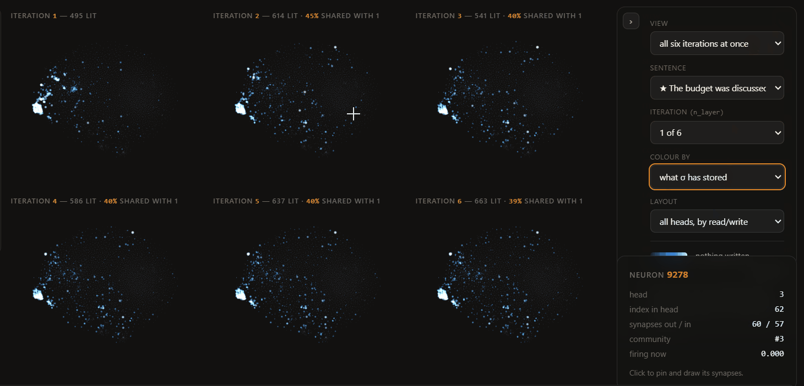

<sup>**Six iterations of one operator, not six layers.** BDH is weight-tied: `encoder`,
`decoder_x` and `decoder_y` are built once and reused, so `n_layer` is an iteration count. Here the
same weights are applied six times to the same sentence, at the same byte. The neuron count rises
across the tiles while the overlap with iteration 1 falls and then settles — the shared operator
*recruits*, then converges. The tile labels carry the overlap, because six similar-looking clouds
without it teach nothing.</sup>

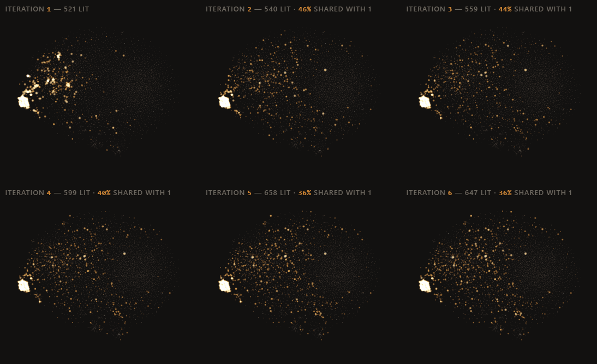

<sup>**The same view, playing — which is what makes it evidence.** A still shows one token, and
the fair objection to the tiles above is that their numbers could be a single lucky sample. Watch
the labels instead of the clouds: every count and every overlap recomputes as playback advances,
and the shape survives it. Two frames a few seconds apart read `593 · 597 · 732 · 697 · 769 · 807`
neurons lit at 40% → 30% overlap with iteration 1, and `542 · 555 · 633 · 748 · 822 · 803` at
41% → 29%. On both, and on the frames between, the count is higher at iteration 6 than at
iteration 1 while the overlap never rises — the operator keeps bringing new neurons in and the
population it is working with keeps drifting away from where it started. Neither trend is strictly
monotonic step to step, which is why the claim is about the run and not about any one pair of
tiles. The bright cluster on the left fires in all six on every frame; the interior is what fills
in. That difference — neurons the model always uses, against neurons it recruits on later
passes — is only visible in motion.</sup>

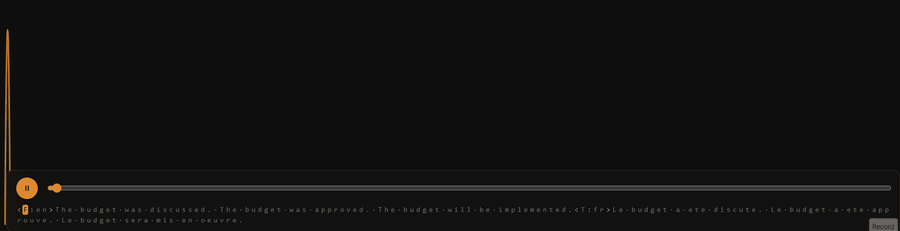

<sup>**Attention as arcs.** BDH has no decay term. What makes it forget is that RoPE rotates keys
before they meet, so scores between distant tokens can go negative and cancel earlier writes. Over
the corpus **34.3% of causal scores are negative** (14.7%–38.5% per sentence). The page computes
the per-sentence figure live and prints the pooled one beside it.</sup>

### 2. THE LOOP — what actually happens inside one iteration?

Eight stops through a single block, over a persistent architecture diagram that stays on screen
the whole way.

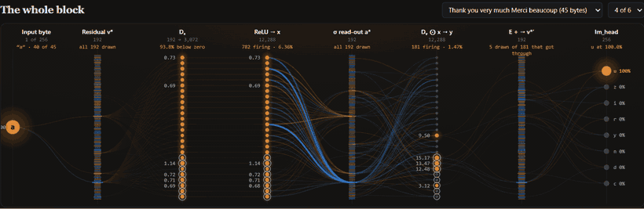

<sup>**Stop 0: the whole block, as eight columns.** `byte → v* → Dₓ → ReLU x → σ read-out a* →
Dᵧ⊙x y → E + Δv → lm_head`. Every edge's width and colour is `weight × source activation` — the
actual term that source contributes to that target — read from the shipped tensors, not
illustrated. The column headers carry the live counts: `95.1% below zero` after `Dₓ`,
`626 firing · 5.09%` after the ReLU, `117 firing · 0.95%` after the gate. Fewer than one neuron in
a hundred reaches the residual.</sup>

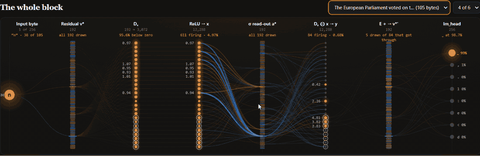

<sup>**Click any node and it traces.** Not just the edges touching it — the full path in both
directions to the ends of the graph, brightness by hop, everything off the path in a hueless grey
so colour keeps meaning sign. The card reports how far it reached: `3 direct · 10 on its path,
across 6 of 8 columns`. The clip also steps the iteration selector, which is why the sparsity
readouts move between frames.</sup>

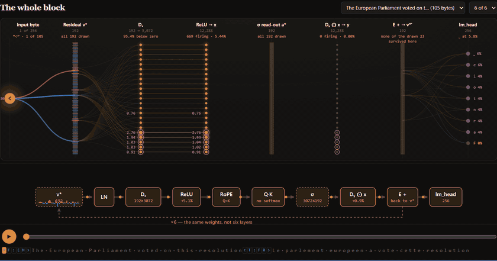

<sup>**The eight stops.** One of them is the RoPE stop, whose polar plot draws a single token's
neuron pairs before and after rotation: every un-rotated key sits inside the non-negative quadrant
because it just came out of a ReLU, and `111 of 3,072` rotated components have gone below zero.
σ on this page is not shipped — it is accumulated in your browser from the model's own rank-one
writes, and a gate proves the accumulation is right by breaking it two ways.</sup>

### 3. THE PRICE — what is the claim, and what does it cost?

A twelve-slide deck. The 131K model runs live here: the forward pass, σ, the
parallel↔recurrent residual, the three ablation toggles, and the capacity sweep are all computed
in the tab as you move the controls.

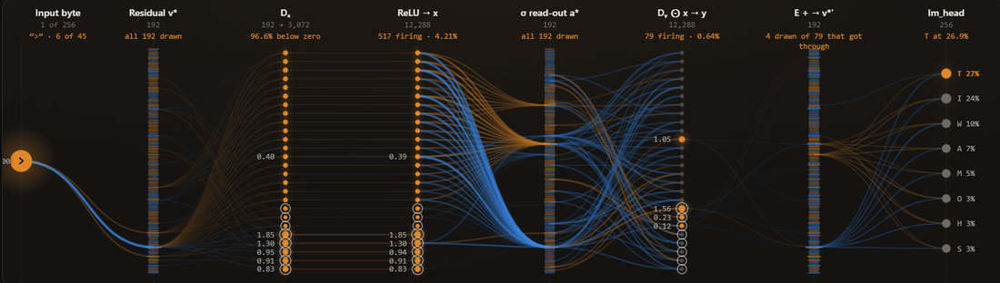

## The idea, in three steps

**1. A Transformer's adaptation lives in a cache that grows.** Every new token appends a K and a V
to every layer's cache. Nothing about the model changes; the context does, and it costs memory
linearly.

**2. Softmax-free attention with `Q = K` has an exact recurrent form.** The same arithmetic,
reassociated, carries the whole history in a fixed-size associative state updated by rank-one
writes:

```
σₜ    =  σₜ₋₁ + rope(K)ₜ ⊗ Vₜ
outₜ  =  σₜᵀ rope(Q)ₜ
```

This is not an approximation. The official MIT `bdh.py` run both ways agrees to
**2.8 × 10⁻¹⁴ in float64** ([`research/verify_equivalence.py`](research/verify_equivalence.py)).
Each demonstration you put in the prompt is literally a rank-one update to a weight matrix — which
is why the claim is not a metaphor.

**3. The obvious intuition about *why* is wrong.** BDH makes three unusual choices — no softmax,
`Q = K`, and a ReLU that forces activations non-negative — and it is tempting to assume all three
buy the constant-size state. Ablate them one at a time and only one does. That is the hinge the
whole artifact turns on, and it is a one-click experiment on THE PRICE.

## Where this sits

The honest positioning first, then the measurement.

| | What adapts at inference | State per extra token | What you can inspect | Runs here? |
|---|---|---|---|---|
| **Decoder-only Transformer** (GPT-style) | the context window | K and V per layer — **grows linearly** | attention maps | — |
| **Linear attention / DeltaNet** | a recurrent state | **constant**; DeltaNet replaces the additive write with a delta rule | the state, in principle | — |
| **BDH** (public, MIT) | a recurrent state σ, written rank-one per token | **constant** | sparse activations **and a standing synapse graph** | **yes — we train and run it** |
| **BDH-CQ** | a recurrent state, general update `U_θ` | constant; dimensions undisclosed | nothing published | no — no public weights or API |
| **HRM / TRM** | the **weights** — a backward pass per task | no context state of this kind | — | no — cited only |

The comparison that matters is against a decoder-only Transformer, because that is the one where
both architectures are doing the same job — decoding one token at a time, carrying whatever they
need from what came before. That comparison is exact, and it is the next section.

### What constant memory buys, and what it costs

**What it buys is a guarantee**: a KV cache grows without bound, and BDH's state does not. Whatever
the context length, σ is the same size. What that guarantee costs is a fixed premium at short
context, and the honest version of the claim says which side of the line a given model sits on.
[`research/compare_memory.py`](research/compare_memory.py) computes both from the two configs this
repo ships — no weights and no torch required, so it runs on a clean clone.

| Model | KV cache, same D/L/H | BDH state σ | Crossover | At its own context |
|---|---|---|---|---|
| **8M translation BDH** (6 × 192, 4 heads, N = 3,072) | 4,608 B/token | **28.3 MB, flat** | **6,144 tokens** | σ is **12.0× larger** than the cache would be at 512 |
| **131K cipher BDH** (4 × 64, 2 heads, N = 256) | 1,024 B/token | **0.26 MB, flat** | **256 tokens** | σ is **1.7× larger** at its 147-byte prompt |

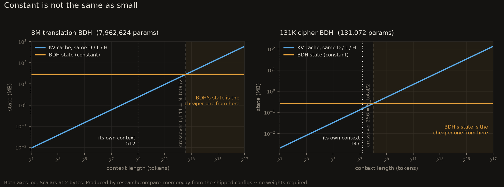

Dividing one by the other, `D`, `L` and the dtype all cancel:

```
T*  =  (L·H·N·D·b) / (2·L·D·b)  =  H·N/2  =  N_total / 2
```

**BDH's state is the cheaper one exactly when the context is longer than half the model's neuron
count.** That is a property of the architecture, not of a hyperparameter or a dtype, and it holds
for both models here. The same cancellation on arithmetic per generated token puts the compute
crossover at `N·H = N_total`, twice as far out.

Below the crossover you are paying the premium for the guarantee; above it you are collecting on
it, and the gap keeps widening because one curve is flat and the other is not. Both of our models
are trained below their own line — a 12,288-neuron model wants contexts past 6,144 bytes to start
banking the trade, and ours was trained at 512. That is a statement about the checkpoints we have,
not about the architecture: the line moves with `N_total`, and it is the only quantity that sets it.

## What we measured

Everything below is produced by a named script in this repo. Nothing is quoted from memory, and
nothing on any page is typed in by hand.

### 1. The parallel↔recurrent equivalence is exact — and only one choice is load-bearing

`research/verify_equivalence.py` · `npm run test:equivalence` · live on THE PRICE

| Check | Result |
|---|---|
| float64 residual, parallel vs recurrent | `2.8e-14` — exact |
| Browser JS vs PyTorch logits | `5.2e-7` worst relative, argmax agreement 100% |
| `Q ≠ K` | equivalence **survives** (`1.7e-5`) |
| no ReLU | equivalence **survives** (`1.6e-5`) |
| **softmax on** | equivalence **breaks** (`1.2e+02`) |

**Softmax-freeness buys the fixed-size state. `Q = K` and the ReLU buy readability**, which is
what the rest of the artifact is about. An early draft of our own plan claimed otherwise and the
measurement corrected it. The script asserts the negative results too, so if someone later
"improves" the model and quietly breaks the story, the build fails.

### 2. Non-negativity is a trade: readability bought, capacity spent, at a rate of 1/π

`research/sigma_capacity.py`, ported to JS and checked against the PyTorch original by
`npm run test:capacity`

Write `k` rank-one bindings into a fixed `N × D` state and read them back. One command prints
both rows; the only difference between them is the ReLU on the keys:

| k | 8 | 16 | 32 | 64 | 128 | 256 | 384 | 512 |
|---|---|---|---|---|---|---|---|---|
| **non-negative keys** (BDH) | 100% | 99% | 94% | 75% | 48% | 23% | 14% | 10% |
| **signed keys** (counterfactual) | 100% | 100% | 100% | 100% | 100% | 100% | 99% | 96% |

The counterfactual is what makes this a mechanism rather than a curve — same state, same size,
same rank bound, one ReLU removed. Mean pairwise cosine is **+0.320** for ReLU'd keys against
**−0.000** for signed, and +0.320 is not noise: it is analytic, **1/π = 0.3183** for rectified
Gaussians. Non-negative vectors cannot be near-orthogonal, so they interfere. At k = 128 the signed
state still retrieves 100% and the non-negative one 48%.

That is the price of the thing the architecture is for. The same ReLU that puts these keys in the
positive orthant is what makes activations sparse and readable, what makes `G*` a graph you can
draw, and what makes a synapse interpretable as a synapse — results 3, 4 and 6 below all rest on
it. A model that spends its capacity this way is buying something specific with it.

Careful with the attribution, both directions: **that non-negativity buys interpretability is the
Dragon Hatchling paper's claim**, and it is cited to them. **That it caps capacity at 1/π is our
measurement.** The ceiling is a known property of the whole linear-attention family rather than
anything peculiar to BDH: DeltaNet ([2406.06484](https://arxiv.org/abs/2406.06484)) replaces "the
additive update in linear transformers" with a delta rule and reports it more effective at
associative recall — and that additive update is precisely BDH's write. Our contribution is the
constant, and the counterfactual that isolates the cause.

### 3. Structure predicts function: `G*` says which neurons stay silent, from the weights alone

`research/export_field.py`, `research/export_walk.py` · recomputed in-browser by `price.js`

`G* = Dₓᵀ Eᵀ` is the standing neuron-to-neuron synapse matrix. It is computed from the weights
with **no data whatsoever**. Yet on 7 sentences of real French:

- **37.1%** of the 12,288 neurons never fire once (4,561 of them); **38.7%** have no synapse in
  `G*` at the p99 threshold.
- They are nearly the same set: **Matthews correlation +0.944**, P(silent | isolated) **94.5%**
  against a **37.1%** base rate. The confusion matrix is 4,496 / 260 / 65 / 7,467.
- Mean total degree is **0.7** for silent neurons against **97.0** for firing ones.
- Firing is brutally concentrated: the top 1% of neurons account for **19.3%** of all firing.

Two things were added later that decide how much weight this can carry, and both are in
[Against a transformer](#against-a-transformer): a **shuffled null** puts the same prediction at
**MCC -0.001**, so +0.944 is a fact about `G*` and not about base rates; and the independently
trained **Portuguese** sibling reproduces it at **+0.908**, so it is a fact about the architecture
and not about one run.

It is also the one picture a Transformer does not offer. The nearest analogue,
`W_out[l] @ W_in[l+1]`, is a map between *two different* neuron populations rather than one shared
one, and at the same p99 threshold only **0.1%** of GPT-2's MLP neurons are isolated in it — so
there is almost nothing for isolation to predict. `G*` exists because BDH is weight-tied and its
attention is a bilinear form over a single neuron basis. That is why THE FIELD is laid out on `G*`
rather than on an embedding projection, and it is why the hero image has a dark region: that is the
disconnected half of the graph.

*Caveats that travel with it:* the corpus is 7 Europarl-style sentences, so "never fires here" is
not "dead forever"; and "isolated" is defined by the p99 threshold, so the count moves if the
threshold moves.

### 4. Sparsity is learned, not imposed

`research/plot_training.py`, from the training run's own telemetry

Nothing in the objective encourages sparsity — no L1 term, no k-winners-take-all, no threshold.
The only structural pressure is the ReLU. The curve that comes out has a shape worth reading:

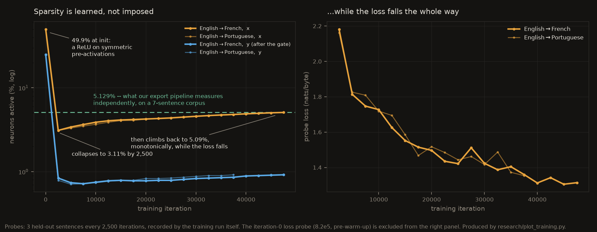

- At initialisation **49.9%** of neurons are active — exactly what a ReLU on roughly symmetric
  pre-activations gives you. Half of everything, on for no reason.
- By iteration 2,500 it has collapsed to **3.11%**. The network's first move is to switch most of
  itself off.
- Then it **climbs back, monotonically, to 5.09%** while the loss keeps falling. It *recruits*.
  The end state is not the sparsest one it ever visited; it is the sparsest one it can afford at
  that loss.
- The gate `y = ReLU(Dᵧ a) ⊙ x` tracks the same shape an order of magnitude lower, ending near
  **0.92%** — an AND of two sparse conditions.

The endpoint corroborates a number this repo measures independently. The training probe lands at
5.09% on three sentences through the training run's own instrumentation; our export pipeline, a
different code path over a 7-sentence corpus and **55,959,552 neuron-token slots**, lands at
**5.129%**. The dashed line on the figure is read from `web/public/big/traces.json` at plot time,
not typed in.

*Caveat:* the training probe is three sentences, not a corpus, and was taken mid-training. It is
evidence about the *shape*. Only the endpoint is independently reproduced.

### 5. Reproducing §7.1's merge outside the precondition it assumes

`research/merge_replicate.py`

The Dragon Hatchling paper's §7.1 merges two models by concatenating every tensor with an `n`
dimension and averaging the rest. Its steps carry a precondition that is easy to read past: the
two models being merged are **clones of a common base**. We had two specialists trained
independently from scratch, so we ran the recipe on a case it does not claim to cover, to find out
what the precondition is actually doing:

| Variant | fr probe loss | pt probe loss | max abs logit |
|---|---|---|---|
| French specialist | 0.785 | 2.699 | 1,097 |
| Portuguese specialist | 3.447 | 0.945 | 971 |
| merged, paper recipe (RoPE concatenated) | 1127.6 | 1049.2 | 40,594 |
| merged, RoPE rebuilt at the new width | 1261.6 | 1171.5 | 45,443 |
| control: paper recipe, `E` scaled by ½ | 563.8 | 524.7 | 20,298 |

The merged model emits `iiiiiiii`. It is **not** a RoPE bug — concatenating the frequency buffer
exactly as the paper says still collapses. It is **not** a magnitude bug — halving `E` halves the
logits exactly, halves the loss, and changes nothing about the output.

What is left is the precondition, and ruling the other two causes out is what turns it from an
assumption into a result: **concatenation along `n` is structurally well defined, but a neuron's
*meaning* is only shared between models descended from one initialisation.** The paper's Table 2
reports 0.39–1.45 for forked models and we have no base to fork from, so this says nothing against
that result — it measures what the shared initialisation was carrying. We say so on the page, too.

### 6. Concept selectivity, measured against a permutation null

`research/export_concepts.py`

Selectivity needs a control, because a neuron that fires on five bytes is trivially 100% selective.
Our first pass at this reported 200 neurons at selectivity 1.0 with nothing to compare them to;
[`models/telemetry/monosemanticity/`](models/) still carries it. Recomputed against a **per-neuron
permutation null** (labels shuffled, activations held fixed, 2,000 draws): 7,040 neurons fire at
all, **2,692 beat their own 95th percentile** against ~352 expected by chance (7.65×), and **1,836
survive Benjamini–Hochberg at 5% FDR**. Null p95 runs 0.59–0.93 for the top neurons, which is why
the number needed the null to mean anything — and 1,836 neurons clearing it is the version of the
claim that holds up.

## The two models

Both are ours and both run. Neither is an official BDH model, and neither is BDH-CQ.

### 8M translation BDH — Europarl, byte-level, trained from scratch

An English→French byte-level BDH: 6 layers × D=192 × 4 heads, N=3,072 per head → **12,288 neurons,
7,962,624 parameters**, a vocabulary of 256 raw bytes and no tokenizer of any kind. It is the
substrate for nearly everything in this repo — the field's 12,288 dots, `G*`, the 5.13% sparsity,
the negative attention scores, the flow diagram's edge values. Trained for 50,000 iterations at
32,768 tokens per step (**1.64 B tokens**) on one A100 in roughly 50 minutes, to **val loss 0.670
nats/byte — 0.967 bits per byte**.

It translates. Greedy decodes from `<F:en>{source}<T:fr>`, straight out of `french_best.pt`:

| English prompt | what the model writes |
|---|---|
| The European Parliament voted against this resolution | Le Parlement européen a voté contre cette résolution |
| Thank you very much. | Merci beaucoup. |
| I would like to thank the rapporteur for his work | Je voudrais remercier le rapporteur pour son travail accompli. |
| This is a matter of great importance for our citizens | Cette question est une question importante pour nos citoyens |
| The Commission must present a report before the end of the year | La Commission doit présenter un rapport avant *l'avenir de l'année prochaine*. |
| The budget was discussed at length yesterday | Le budget a été discuté hier *lors de la discussion de la prochaine session* |

The last two are the honest half of the picture and they are worth reading closely. Agreement,
gender, elision and accents are right throughout — at 8M parameters, from raw bytes, with no
tokenizer — and then the sentence runs out of grounding and completes itself with fluent
parliamentary filler: `avant la fin de l'année` becomes `avant l'avenir de l'année prochaine`. The
failure is fluent rather than garbled, which is the same signature the artifact teaches on THE
PRICE — when the state does not hold the binding, the model does not hedge.

| | |
|---|---|
| Parameters | **7,962,624** — and there are no per-layer weights |
| Layers (`n_layer`) | 6 — an **iteration count of one shared operator**, not depth |
| Width | `D` 192 · 4 heads · `N` 3,072/head → **12,288 neurons** |
| Vocabulary | 256 — raw bytes |
| Data | Europarl v7 en–fr, interleaved as `<F:en>{source}<T:fr>{target}`, 95/5 split |
| Context · batch | 512 bytes · 32 × 2 accumulation = 32,768 tokens/step |
| Schedule | 50,000 iters, AdamW, lr 1e-3 → 1e-4 cosine, 1,000 warm-up, wd 0.1, clip 1.0 |
| Cost | ~50 min on one A100 ≈ **0.85 A100-hours**, 1.64 B tokens |
| Final loss | **0.670 val**, 0.648 train (nats/byte, held-out Europarl) |

Weight tying is why the parameter count is what it is: `encoder`, `decoder_x` and `decoder_y` are
built once and reused inside `for L in range(n_layer)`, so the total is `3·H·D·N + 2·vocab·D` with
no `n_layer` term anywhere. Six "layers" is one operator applied six times — which maps onto
BDH-CQ's Eq. (3) `H_{r+1} = F_θ(H_r, S_K)`, and is why the artifact can show all six iterations of
the *same* weights side by side.

Two deviations from reference BDH, inherited from the checkpoint and stated wherever its numbers
appear on screen: a **learned positional embedding** (`pos_emb`, 4096 × D) on top of RoPE, and **no
decay term**. Everything else is faithful in the respects the artifact depends on — weight-tied,
`Q = K = ReLU(D_x · LN(v))`, `V = LN(v)`, no softmax, strictly causal `tril(-1)`, RoPE inside
attention.

There is an independently trained Portuguese sibling of the same architecture, used here as a
replication check, and the merge of the two from result 5. Full recipe, file inventory and
checksums: **[`models/README.md`](models/README.md)**. The training notebook is committed at
[`models/notebooks/bdh-translation-training.ipynb`](models/notebooks/bdh-translation-training.ipynb);
the weights are GitHub Release assets, because 96 MB files do not belong in a clone.

```bash
gh release download v1.0-models -p 'french_best.pt' -D models/checkpoints/
```

### 131K cipher BDH — trained here, runs in your browser

Trained by [`research/train.py`](research/train.py) on an in-context substitution cipher
([`research/cipher_task.py`](research/cipher_task.py)) that resamples a **fresh bijection per
example**, so the mapping exists only in the prompt. The only way to answer is to read it out of
the recurrent state. Source symbols render as shapes and targets as colours, which makes the task
a visual miniature of BDH-CQ §6.3 — a fresh colour permutation defined entirely by demonstrations.

Exported to fp16 (`web/public/model.bin`, 257 KB) and re-implemented as a hand-written forward
pass in plain typed arrays ([`web/src/bdh.js`](web/src/bdh.js)) — 20–85 ms per forward, no WebGPU
needed. Parity against PyTorch: **5.2e-7 worst relative logit error** with every argmax agreeing.

Accuracy, trained on k ∈ [2,12] with a 48-symbol alphabet (chance = 2.1%):

| k | 2–12 | 16 | 20 | 24 | 32 | 48 |
|---|---|---|---|---|---|---|
| accuracy | **100%** | 64% | 40% | 20% | 9% | 3% |

**This curve is a demonstration-coverage limit, not a capacity limit.** The same state retrieves
99% at k = 16 when measured directly. Conflating the two is a factual error, and the artifact
teaches them as separate lessons on separate slides.

## Against a transformer

Everything below is measured by a script in this repo, on the models this repo ships, and written
to `research/runs/*.json` so the tables cannot drift from what was run.

**Read this first, because it governs every number in the section.** We did not train a control.
A parameter-matched Transformer on the same bytes at the same budget is the experiment that would
isolate an architecture's contribution, and we did not have the GPU time for it. So the baselines
here are *public pretrained models* — other people's, on other data, at other scales, with other
tokenizers. **None of this is an ablation and none of it says BDH is better than a Transformer.**
What each comparison is good for is stated where it appears, and the two that carry real weight are
the ones needing no baseline at all: an exact cost model, and a within-model null.

### 1. What it costs to run — measured, not derived

`research/compare_runtime.py`

`BigBDH.forward` is the *parallel* form: it re-reads the whole prefix every call, which is the same
cost profile as the thing it is meant to beat. Timing that would have measured the wrong object, so
this script first builds the **recurrent** decode at 8M scale — σ of shape `N × D` per layer and
head, read then written one rank-one update at a time — and checks it against the parallel forward:

| | |
|---|---|
| recurrent vs parallel, worst relative logit error | **5.96e-7** (float32) |
| negative control: the write moved before the read | 5.3e-1 — **897,000× worse** |

The control is the point. `tril(-1)` is strictly causal, so token *t* attends to *s < t* and not to
itself; a tolerance that would accept the wrong order proves nothing. With the recurrence verified,
the cost model becomes measurable rather than arithmetic:

| context | 64 | 512 | 4,096 | 8,192 | 16,384 |
|---|---|---|---|---|---|
| KV cache, same D/L/H (fp16) | 0.3 MB | 2.4 MB | 18.9 MB | 37.8 MB | **75.5 MB** |
| BDH state σ | 28.3 MB | 28.3 MB | 28.3 MB | **28.3 MB** | **28.3 MB** |

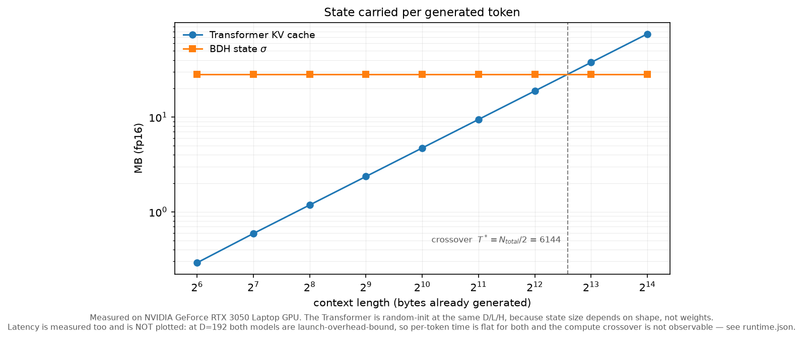

`compare_memory.py` predicts the crossover at `N_total/2 = 6,144`; the measured curves cross between
4,096 and 8,192, the first sampled point past it. **The arithmetic survives measurement.**

**The latency half reports a null, and the script says so on its own output.** At `D = 192` with
four heads of 48 dimensions, one decode step is a few MFLOP — far too little to occupy a GPU — so
both models sit on a floor of kernel-launch overhead, and per-token time is flat for *both* —
across a **256-fold** increase in context it changes by ×0.97 for BDH and ×1.02 for the Transformer
(4.5–5.4 ms and 2.9–3.2 ms respectively). The predicted compute crossover at `N_total` is simply
not observable at this model size on this hardware. What
the numbers do support is the shape: BDH's per-token cost does not depend on context because it has
no prefix to re-read, and below the crossover it pays a premium in time for the same reason it pays
one in bytes — it moves its whole 28.3 MB state on every token however little context there is.
`recurrent_step` is a readable reference implementation, not a tuned kernel; do not quote it as a
throughput benchmark.

Getting that null to be *stable* took three tries and is worth recording. Timing one step measures
Python, not the model, so each point times 32 consecutive tokens and divides. Latency is
contaminated upwards only, so the estimator is the **minimum** over repetitions rather than the
median — on a laptop GPU the median is largely a picture of the thermal state. And a single sweep
is still not enough: one pass reported the last context as **3.4× faster** than the first, which is
nonsense, so each point is the minimum of three independent sweeps. The figure plots only the
memory panel, because a flat-but-noisy curve on a log axis reads as structure that is not there.

### 2. What you can see inside it — with a null, and with a contrast

`research/compare_structure.py`

**The definitional trap first, because getting it wrong would be a cheap win.** BDH's `x = ReLU(·)`
produces exact zeros, so "active" is unambiguous. GPT-2's MLP uses GELU, which is *never* exactly
zero — so any comparison has to name its predicate. All three are reported:

| | exactly zero | > 0 | **above 1% of that token's peak** |
|---|---|---|---|
| **8M BDH**, on the French it generates | 94.8% | 5.17% | **4.93%** |
| **GPT-2** (124M), on English | 0.1% | 16.2% | **86.3%** |
| **GPT-2**, on the same French | 0.0% | 14.1% | **87.5%** |

The third column is the honest one, and the gap on it is **17×**. The third row is the robustness
check: GPT-2's density barely moves between English and French, so the contrast is not an artifact
of measuring each model on different text. BDH's `> 0` figure lands at 5.17% against the
**5.13%** this repo reports elsewhere — a fourth code path on a different corpus, agreeing to four
hundredths of a percentage point.

**Does structure predict function?** `G* = Dₓᵀ Eᵀ` is computed from the weights with no data at all,
and isolation in it predicts which neurons never fire on real text at **MCC +0.940**. What licenses
that claim is the null, not the baseline:

| | MCC | isolated share |
|---|---|---|
| **BDH**, `G*` isolation → silence | **+0.940** | 38.7% |
| **BDH, shuffled null** (200 draws, degrees permuted) | **−0.001** (p95 +0.013) | — |
| GPT-2, `W_out[l] @ W_in[l+1]` isolation → silence | −0.004 | **0.1%** |

The null collapsing to zero is what makes +0.940 a fact about `G*` rather than about base rates.

**The GPT-2 row is not a defeat for GPT-2 and must not be reported as one.** Look at its isolated
share: at the same p99 threshold, **0.1%** of its MLP neurons are disconnected, so there is almost
nothing for isolation to predict. That is the actual finding, and it is structural rather than
numerical. `G*` exists because BDH is **weight-tied** — one neuron population, the same matrices
every iteration — and because its attention is a bilinear form over that one basis. A Transformer's
layer *l* and layer *l+1* hold *different* neurons, and its token mixing runs through a softmax
computed from the data that is nowhere in the weights. The question "which neurons will never fire,
from the weights alone" is well posed for one architecture and not for the other. That is what
weight-tying buys, and it is the strongest claim in this section.

### 3. What it knows — bits per byte, on two sets

`research/compare_quality.py`

Loss has always been quoted here as 0.670 nats/byte, which is comparable to nothing, because every
other model reports loss per token under its own tokenizer. **Bits per byte is tokenizer-agnostic**,
so every model below is measured on the same text, in the same 480-character windows, scored on the
second half of each window, and divided by the same UTF-8 byte count.

Two evaluation sets, because one would be misleading. Two confounds run in opposite directions and
both are named: our model is a **specialist** trained on exactly the in-domain format, which
flatters us there; and Europarl v7 is old and public, so it is plausibly inside the public models'
**pretraining data**, which flatters them.

| model | params | out-of-domain (French prose) |
|---|---|---|
| **8M BDH (ours)** | **8.0M** | 3.083 |
| GPT-2 | 124M | 2.145 |
| SmolLM2-135M | 135M | 1.686 |
| BLOOM-560m | 560M | **1.216** |

<sup>bits per byte, lower is better; ~20,300 scored bytes per model, within 1% of each other because
the windows are cut on character boundaries and the denominator is the same span for everyone</sup>

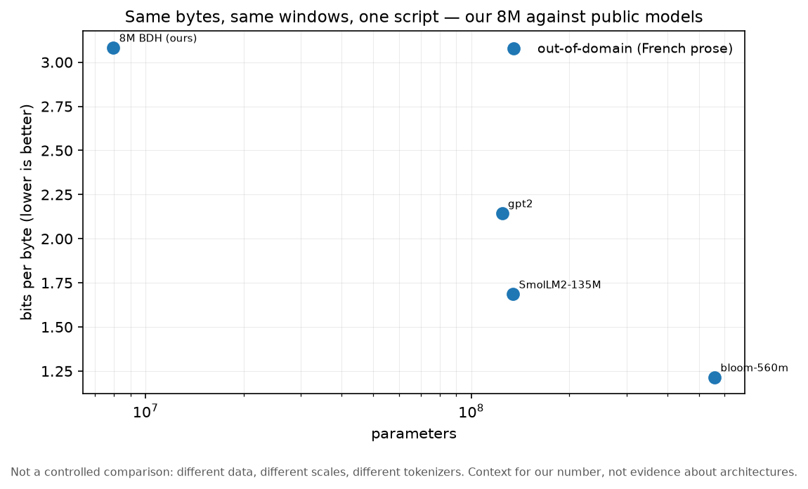

**We lose this one, by a lot, and that is the informative half.** Out of domain — French prose from
a different century and genre, with no `<F:en>` tags — our 8M model reads at **3.08 bits/byte**
while a 560M multilingual model reads at 1.22. It is a specialist: trained on Europarl in one exact
format for 50 minutes, and it does not generalise past that. Against its **0.967 bits/byte** on the
distribution it was trained for, the specialisation gap is **3.2×**, and naming that gap is what
makes the in-domain number honest rather than impressive.

Two normalisations are applied to the out-of-domain text and disclosed in the script: typographic
quotes and dashes are folded to ASCII, and Gutenberg's 70-column wrapping is unwrapped into
paragraphs. Without them most of the penalty would be our model meeting `U+2019` for the first
time, which measures character set rather than genre. (An earlier run anchored on the first
"CHAPITRE" and scored the **table of contents** at 10.04 bits/byte — worse than uniform. If a
byte-level number comes out above 8, look at the text before believing it.)

**The in-domain half of this table is not filled in yet**, because it needs the model's actual
held-out split and Europarl v7 downloads from statmt.org at about 1.5 MB/min. The script rebuilds
it with the notebook's own 95/5 cut of the byte stream, so the evaluation text is the same data the
0.670 nats/byte was measured on:

```bash
python research/compare_quality.py        # fetches the corpus on first run, then measures all four
```

### 4. How long a fixed state holds a binding

`research/probe_incontext.py`

The capacity result in result 2 above writes synthetic keys into a synthetic σ. This asks the same
question *through the trained model*: show it a span, put *d* bytes of filler in between, show the
span again, and measure how many bits it saved. Against a **matched control** — the identical
sequence with an unrelated span in the first slot, so the measured span sits at the same position
after the same filler, and only its earlier presence differs.

| filler between the two occurrences | 0 | 64 | 128 | 256 | 384 |
|---|---|---|---|---|---|
| in-distribution text spans | 0.070 | 0.081 | 0.067 | 0.069 | **0.043** |
| random byte spans | −0.113 | −0.004 | 0.022 | 0.007 | 0.041 |

<sup>bits/byte saved on the repeat; 40 trials per cell, standard errors 0.01–0.09</sup>

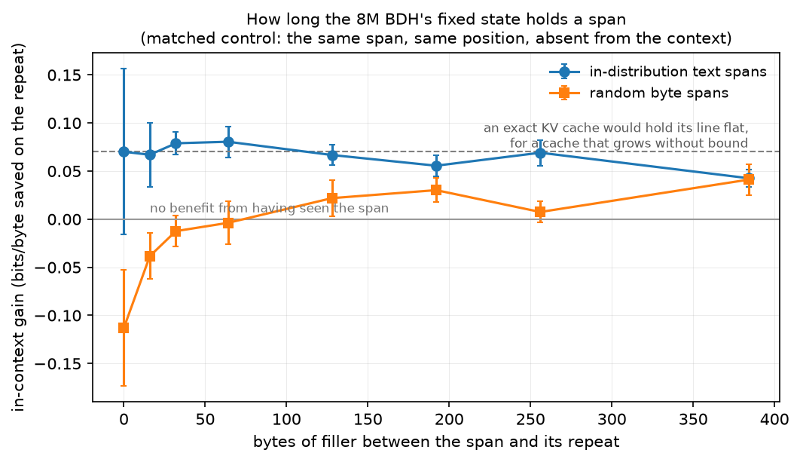

Two readings, and the second is the more interesting.

- On text the gain is small but **consistently positive — 7 of 8 distances at more than two
  standard errors** — and it decays with distance, which is a fixed state holding something and
  gradually losing it. A softmax Transformer's line here is **flat by construction**: a KV cache
  keeps every past key exactly, at any distance inside the window, which is precisely what it is
  buying with the memory curve in §1. That reference needs no baseline run to draw.
- On **random** spans the gain is indistinguishable from zero at every distance. This model has not
  learned a general copy mechanism — nothing in translating Europarl rewards reproducing an
  arbitrary byte string, and it did not learn to. **In-context retrieval is a trained capability,
  not a free consequence of having a recurrent state.** That is why the 131K cipher model, whose
  task cannot be solved any other way, reads its bindings straight out of context and this one does
  not. It is also a caveat this project's own headline has to carry: demonstrations are weights
  *in a model trained to use them that way*.

### 5. Does any of it replicate?

`research/replicate_structure.py`

Every structural number above was measured on one checkpoint. The control was in the same directory
the whole time: the **Portuguese** sibling is the same architecture and recipe on a different
language pair, from a different initialisation, for a different number of iterations — and it
shares no weights with the French model, which is what the failed merge in result 5 established.

| | French (50k iters) | Portuguese (40k iters) |
|---|---|---|
| **weights only** — no data involved | | |
| neurons with no synapse in `G*` | 38.7% | 34.6% |
| max out-degree, head 0 | 749 | 718 |
| neurons carrying half the edge endpoints | 13.4% | 13.9% |
| **weights and data** — each on its own output | | |
| `x` active | 5.18% | 4.90% |
| `y` active, the gate | **0.97%** | **0.98%** |
| negative causal scores at L3/H0 | 35.3% | 48.0% |
| ...across iterations 1 → 6 | 58% → 35% | 56% → 39% |
| neurons never firing | 36.8% | 31.7% |
| **MCC(isolated, silent)** | **+0.940** | **+0.908** |
| P(silent given isolated) | 93.9% | 89.8% |

The heavy tail, the gate's ~1%, the fall in negativity across iterations and the silence prediction
all reproduce. **These are properties of the architecture, not of one training run.** Two caveats
travel with the lower half of the table: the two models are measured on different text, because
each is measured on what it generates rather than on the other's language; and `G*`'s edge budget is
identical by construction (377,488 for both), because the threshold is a percentile — only the
*structure* of the two graphs is free to differ, which is the comparison being made.

One number here needs reconciling with the rest of this README, and it reconciles cleanly. This
script pools **all six iterations** and gets 42.7% negative scores for French; the **34.3%** quoted
elsewhere is **L3/H0 only**, and at L3/H0 on this corpus the figure is 35.3%. Both are correct.
Negativity falls with iteration on both models, so pooling every layer necessarily reads higher.

## How it is built

No framework, no build step, no bundler. Every module that touches data is pure and separately
gated before a controller uses it — which is why the science can be tested in Node with no
browser at all.

```
research/                  offline: train, measure, export
  bdh_big.py               the 8M architecture, transcribed from the training notebook
  cipher_task.py           the synthetic in-context task (fresh bijection per example)
  train.py                 trains the 131K model -> runs/final.pt
  export_weights.py        -> web/public/model.{json,bin}   (fp16, 257 KB)
  export_field.py          G*, Louvain, three layouts       -> web/public/big/field.*
  export_traces.py         per-token activations, attention, sigma energy -> big/traces.bin.gz
  export_walk.py           the two walk sentences, every stage -> web/public/walk.bin.gz
  export_concepts.py       concept selectivity against a permutation null
  merge_replicate.py       the neuron-concatenation merge experiment
  verify_equivalence.py    the PyTorch twin of the equivalence gate
  sigma_capacity.py        the 1/pi measurement and its signed counterfactual
  compare_memory.py        KV cache vs sigma, and the N_total/2 crossover
  plot_training.py         the sparsity-emergence figure
  serve.py                 dev server: no-store, and pins .gz to octet-stream
  check_mobile.py          narrow-viewport measurement over the DevTools protocol

web/src/                   pure modules first, then the controllers that use them
  bdh.js                   the 131K forward pass + trace(), plain typed arrays
  bigdata.js walkdata.js field-data.js flow-data.js   pure decode/derive: no DOM, no GL
  capacity.js chart.js sigma-view.js tokens.js palette.js
  field-gl.js              hand-rolled WebGL2, HDR float target + a tone map
  inspector.js             THE FIELD's controller                        (frozen)
  loop.js stages.js flow.js diagram.js                                   THE LOOP
  price.js                                                               THE PRICE

models/                    the 8M checkpoints, notebook and telemetry  (see models/README.md)
docs/                      the one-page summary, the defense sheet, the media and its encoder
```

**The payload is a budget, and it is measured on the wire.** THE FIELD ships 6.37 MB, THE LOOP
4.90 MB, THE PRICE 0.50 MB. Two decisions kept that sane:

- **`traces.bin.gz` is gzipped and the streams compress very unevenly** — measuring that decided
  the design. Sorted uint16 neuron indices compress to **0.43**, the smooth sigma-energy ramp to
  **0.21**, and the uint8 activation values to **0.92**, because they are noise and nothing will
  compress them. Net 0.52, so seven sentences of full data cost 5.89 MB instead of 11.34 MB. The
  browser inflates it with `DecompressionStream`; the manifest declares the compression so there
  is no 404-then-retry.
- **Derivable tensors are not shipped.** `x_pre` was 2.76 MB to say something reconstructible from
  two matrices already in the pack; shipping the 1.18 MB matrix instead made the pack smaller
  *and* the values more accurate (f16-weight accurate at 2.1e-4, rather than uint8-quantised at
  ~4e-3). RoPE is re-derived in the browser from `rope_freqs`, and σ is accumulated from the
  rank-one writes. Each of those is licensed by a gate with a negative control, not by assertion.

**`web/field.html` is frozen and checksummed.** It is finished; `web/test/frozen.mjs` sha256s it
plus the eleven files it loads and runs first in `npm test`. This is why `theme.css` duplicates
field.css's `:root` block and nav rules instead of sharing them — hoisting would have edited a
finished page — and why `wiring.mjs` asserts the two copies stay byte-identical. To change it
deliberately: edit, then `npm run freeze`.

## The test suite, and what each gate caught

`npm test` runs twelve gates and 236 checks in this order. Several of them exist because a
specific bug shipped past everything else.

| Gate | What it protects |
|---|---|
| `frozen` | field.html and its eleven files are byte-identical to the frozen checksums |
| `price_smoke` | boots THE PRICE in jsdom; 77 checks; canvases must paint non-uniform pixels; the evidence ledger's disclosures must be present |
| `field_smoke` | boots THE FIELD on both render paths; readouts must **differ** between sentences |
| `bigdata` | shipped bytes round-trip within 0.5 quantisation steps; re-derives the sparsity and negative-score figures from them |
| `walk` | RoPE re-derivation and σ accumulation, each with a negative control (247× and 580× worse) |
| `loop_smoke` | boots THE LOOP; 74 checks; measures canvas *contrast*; records vector draws; pins the diagram's span |
| `field` | palette monotonic in OKLab L; the pure transforms |
| `validate` | browser JS against PyTorch, on a recorded fixture |
| `equivalence` | parallel↔recurrent, plus the three ablations including the ones that must **not** break |
| `app_logic` | the sixty-second moment, including the `(src, tgt, SEP)` token order |
| `capacity` | the JS capacity port matches PyTorch within 10 pp at every k |
| `wiring` | element ids, generated class names, the shared nav, the door's framing, ≥3 in-window papers cited beside claims |

The honesty layer is enforced as tests, not as a convention: the evidence ledger's seven tiers,
both unreconciled BDH-CQ costs, the co-author disclosure, the ConceptARC training overlap, "no
ARC-AGI-2 result exists", the correction to the problem statement's own half-truth, the section
locators, "R is never stated", the merge's not-a-refutation line, and the checkpoint's two
deviations. **Dropping any one of them fails the build.**

### What actually shipped broken, and the gate that now catches it

| What went wrong | Why every gate stayed green | The gate that catches it now |
|---|---|---|
| A patch dropped a `function` declaration; the module threw on load and the page rendered **completely empty placeholders** | no gate ever executed the entry point — they tested the model, the ports and the markup, and the glue between them | `price_smoke` boots the real page in jsdom and asserts ~80 elements populate |
| Three σ views shipped as **black rectangles** — `forward()` returns one entry per (layer, head), not per token | a canvas stub that swallows every draw cannot tell a heatmap from a black rectangle | the stub now records `putImageData` per canvas and requires ≥3 distinct colours |
| Heatmaps normalised by **max** instead of a percentile; σ's median cell is 4e-4 of its max, so **83% of pixels** landed within 5% of neutral and the panel read as blank grey | "was something painted?" passed — there was variety, all of it within a few units of neutral | `loop_smoke` measures *contrast*: the share of pixels far from the midpoint, requiring >25% |
| Six of seven sentences were **dead on THE FIELD** — views were gated on a flag rather than on whether the data was present | the gates only ever asserted against the hero sentence and never changed the selector | all three field gates sweep all seven sentences and require the readouts to **differ** |
| The next-byte column ranked by `|value|`, so it showed the eight bytes the model most strongly **ruled out**, every one at p = 0.00% | 55 assertions passed; nobody printed what the column would actually say | found by dumping a frame's headers to stdout — now a fixed `topSigned`, and the lesson is in the handoff |
| A stylesheet defined `.chip.big` where the code generates `chip chip-big`, so chips rendered as unstyled boxes | class names were built by string concatenation and never compared to the CSS | `wiring` asserts every generated class name is actually styled |
| **The first gate only passed on one machine.** Four frozen files were CRLF in a Windows working tree and LF in the repository, so the checksums matched nowhere else | nobody had ever run the suite on a clean clone on another platform | `.gitattributes` pins `eol=lf`; the checksums now describe the same bytes everywhere, and CI runs the suite on Linux on every push |

The general lesson, stated once: **a test that never visits the broken case is not testing
anything.** Every row above is an assertion that existed and passed while the product was wrong.

## Reproducing

Nothing here needs a GPU or a network unless you are retraining.

```bash
npm ci
npm test                # 12 gates, 236 checks
npm run dev             # serve the artifact at http://localhost:8080
```

| Command | What it does | Needs |
|---|---|---|
| `npm test` | the full suite | node only |
| `npm run test:mobile` | narrow-viewport measurement at 390 / 360 / 320 px | Edge or Chrome + `websocket-client` |
| `npm run figures` | rebuilds `docs/media/memory-crossover.png` and `sparsity-emergence.png` | python + matplotlib |
| `npm run summary` | rebuilds `docs/concept-summary.{html,pdf}` | python + Edge/Chrome |
| `npm run media` | re-encodes the screen captures from `docs/media/_originals/` | ffmpeg |
| `npm run train` | retrains the 131K model (~65 min) | python + torch + GPU |
| `npm run export` | weights, fixture and verified presets | python + torch |
| `npm run verify:torch` | the PyTorch twin of the equivalence gate | python + torch |
| `npm run export:big` / `export:walk` | re-exports everything the 8M pages read | the released checkpoints |
| `npm run compare` | the whole [Against a transformer](#against-a-transformer) section: runtime, structure, in-context, replication | python + torch + the checkpoints |
| `npm run compare:quality` | bits/byte and chrF against the public models | + `transformers`, `sacrebleu`, ~2 GB of downloads and the Europarl corpus |
| `python research/compare_runtime.py --check` | verifies the 8M recurrent decode against the parallel forward | python + torch |

**After any retrain, run `python research/make_presets.py`.** It re-verifies the sixty-second
moment and prints `SIXTY-SECOND MOMENT HOLDS` or `DOES NOT HOLD`.

## Honest limitations

**What this artifact cannot show you.**

- The live model is **131K parameters on a synthetic task**. It is an honest miniature, not
  evidence about BDH at scale. The 8M model is real language, but still small.
- The toy runs **~43% active** neurons, nowhere near the ~5% BDH reports at scale. Our 8M model
  *does* reach **5.13%**, measured through our own pipeline — but that is our model, not theirs.
  The BDH paper's own ~5% figure has not been verified by us against the primary source and is
  never quoted as ours.
- σ is **dense**, not sparse ridges: 100% of its cells are non-zero within a few tokens. What is
  legible is Δσ per token, a before/after difference, and row energy — which is what we draw.
- The negative-attention-score share is **per sentence** (14.7%–38.5%, pooled 34.3%), not one
  number.
- The sparsity-emergence curve's intermediate points come from a **three-sentence probe**. Only
  its endpoint is independently reproduced.
- The 8M checkpoints carry **two deviations from reference BDH** — a learned positional embedding
  on top of RoPE, and no decay term — so results measured on them are results about these
  checkpoints first.
- The §7.1 merge was run **outside the precondition the paper states**, on models with no shared
  initialisation. It says nothing about the merges the paper actually reports.
- **The transformer baselines are not controls.** No parameter-matched Transformer was trained on
  the same bytes at the same budget, so nothing in
  [Against a transformer](#against-a-transformer) isolates an architecture's contribution. The two
  results there that do not depend on a baseline — the exact cost model and the shuffled null — are
  the ones to lean on.
- **The in-context probe is a negative result about our own model.** The 8M translation BDH shows
  no measurable gain on repeated *random* spans, so it has not learned a general copy mechanism.
  "Demonstrations are weights" holds in a model trained to use them that way; the 131K cipher model
  is that, and this one is not.
- **BDH-CQ figures are replayed, never reproduced.** It has no public weights and no public API.
  We cannot run it and do not claim to.
- Mobile is verified for **layout** at 320–390 px. On phones THE LOOP's flow diagram keeps its
  design width and scrolls sideways, with a note on screen saying so.

**What the architecture trades.** These are costs, and each one is buying something specific.

| cost | what it buys |
|---|---|
| σ is constant but **large** — 12× an equal-dimension KV cache at the 512 bytes this model was trained on ([the crossover](#what-constant-memory-buys-and-what-it-costs)) | a state that never grows, so the cost is flat at any context and the trade turns positive past `N_total/2` |
| non-negative keys interfere, capping associative recall at a rate of **1/π** | the positive orthant, which is what makes activations sparse, `G*` drawable and a synapse readable as a synapse |
| no decay term, so forgetting happens through RoPE phase interference rather than an explicit gate | one fewer moving part, and a forgetting mechanism you can read straight off the attention scores |

## References and tooling


### Primary sources

Cited beside the claims they support, on the pages and in the summary — not collected at the end.

- Kosowski, Uznański, Chorowski, Stamirowska, Bartoszkiewicz (2025). **The Dragon Hatchling: The
  Missing Link between the Transformer and Models of the Brain.**
  [arXiv:2509.26507](https://arxiv.org/abs/2509.26507) — the architecture, and the source of the
  claim that non-negativity buys interpretable sparse structure. That half is theirs; the price we
  put on it is ours. §7.1 is the merge recipe we replicate.
- Engdahl et al. (2026). **BDH-CQ technical report.**
  [arXiv:2608.09888](https://arxiv.org/abs/2608.09888) — Eq. (1) `Sₜ = U_θ(Sₜ₋₁, Dₜ)` and the
  additive special case named in §3.2, which is exactly what the public BDH code computes. That
  correspondence is the bridge the whole artifact rests on, and it does not require running
  BDH-CQ — which is fortunate, because nobody outside Pathway can.
- Yang, Wang, Zhang, Shen, Kim (2024). **Parallelizing Linear Transformers with the Delta Rule
  over Sequence Length.** [arXiv:2406.06484](https://arxiv.org/abs/2406.06484) — replaces "the
  additive update in linear transformers" with the delta rule and reports it more effective at
  associative recall. That additive update is BDH's write; our 1/π ceiling is why the alternative
  exists.
- Sun et al. (2024). **Learning to (Learn at Test Time): RNNs with Expressive Hidden States.**
  [arXiv:2407.04620](https://arxiv.org/abs/2407.04620) — the update rule as a step of
  self-supervised learning; the contrast that places BDH's write in a design space.
- Wang et al. (2025). **Hierarchical Reasoning Model.**
  [arXiv:2506.21734](https://arxiv.org/abs/2506.21734) and Jolicoeur-Martineau (2025). **Less is
  More: Recursive Reasoning with Tiny Networks.**
  [arXiv:2510.04871](https://arxiv.org/abs/2510.04871) — the optimization route to test-time
  adaptation, and the fork this artifact takes a side in. TRM's 8% on ARC-AGI-2 is TRM's result
  and is never attached to BDH-CQ.

[`research/bdh-cq-dossier.md`](research/bdh-cq-dossier.md) is our verbatim extraction of the
BDH-CQ report with a section locator and an evidence level on every claim. It is canonical for
every BDH-CQ number in this repo, and it exists because a plausible-looking BDH-CQ figure that is
wrong is the failure mode nobody catches.

### Design references

The problem statement benchmarks against explanatory instruments rather than write-ups, and these
are the ones the three pages were built against — for what they do, not to imitate them:
[Transformer Explainer](https://poloclub.github.io/transformer-explainer/) (a full architecture
diagram with data visibly flowing through it),
[TensorFlow Playground](https://playground.tensorflow.org/) and
[GAN Lab](https://poloclub.github.io/ganlab/) (the whole page as one live instrument),
[bbycroft's LLM visualisation](https://bbycroft.net/llm) (a walkthrough where the camera moves
with the narrative), [Distill](https://distill.pub/) (figures that respond to the reader),
[CNN Explainer](https://poloclub.github.io/cnn-explainer/) (hover anything, see it highlighted
everywhere else), and [Neuronpedia](https://www.neuronpedia.org/) (browsing individual units).

### Code, data and tools

- [`pathwaycom/bdh`](https://github.com/pathwaycom/bdh) — the reference implementation, vendored
  **unmodified** at [`vendor/bdh.py`](vendor/bdh.py) under MIT.
- [Europarl v7](https://www.statmt.org/europarl/) en–fr and en–pt — the 8M models' training data.
- PyTorch 2.6 + CUDA for training and export; no ML framework in the browser at all — the forward
  pass is hand-written typed arrays.
- jsdom for the page gates; the Chrome DevTools Protocol for the mobile measurement; ffmpeg for
  the media in this README.
- The colour palette follows the validation method in Claude Code's `dataviz` skill reference:
  every categorical pair is checked for contrast under both themes and under simulated colour
  vision deficiency. That check is why heads are *not* colour-coded and only the top three Louvain
  communities get a hue — only three categorical hues clear all pairs on the field surface.

### On building this

**Claude (Opus 5), via Claude Code, was used throughout** — to read and extract the BDH and BDH-CQ
primary sources into the dossier, to design and write the training, analysis and export code, to
write the browser port of BDH, the three pages and the test suite, and to draft this README and
the concept summary. Understanding BDH well enough to build an explanation of it was itself much
of the work, and that reading was done with Claude against the papers rather than from memory.

Direction, review and every design decision are the team's, as is the prior 8M model. The
discipline that matters here is not who typed what: **every empirical claim in this repo is
produced by a script in this repo**, and the team can trace and defend each one —
[`docs/defense.md`](docs/defense.md) is the working aid for exactly that. No number appears
anywhere in the artifact that is not either produced by a script here or quoted from a primary
source with a locator.

## Attribution and licenses

| Component | Source | License |
|---|---|---|
| `vendor/bdh.py` | [pathwaycom/bdh](https://github.com/pathwaycom/bdh) — **unmodified** | MIT (`vendor/LICENSE-bdh`) |
| 131K trained weights, cipher task, browser port | this repo | MIT |
| 8M En→Fr and En→Pt checkpoints | this team — trained on Europarl v7 ([`models/README.md`](models/README.md)) | MIT |
| All three pages, exports, tests, docs, figures | this repo | MIT |
| Europarl v7 corpus | statmt.org | as published |
| Colour palette and its validation method | Claude Code `dataviz` skill reference | — |
| Fonts | none bundled — system font stacks only | — |
| Graphics | none bundled — everything is drawn at runtime from data | — |

The screen captures in [`docs/media/`](docs/media/) are recordings of this artifact running; the
originals are re-encoded by [`docs/media/encode.sh`](docs/media/encode.sh) from 138 MB down to
about 14 MB, because a README nobody can load explains nothing.

## Deploying

Static, no build step. The site root is `web/`, and `vercel.json` pins it.

The one header that matters: `public/**.bin.gz` must be served as `application/octet-stream`
**with no `Content-Encoding: gzip`**. Both big packs are inflated *by the page* with
`DecompressionStream`, so a transport-level encoding would hand the loader already-inflated bytes.
After deploying, verify on the live origin — not locally:

```bash
curl -sI <url>/public/big/traces.bin.gz | grep -i "content-type\|content-encoding"
curl -sI <url>/public/walk.bin.gz       | grep -i "content-type\|content-encoding"
```

Verified on the live origin: both packs arrive byte-identical to disk. Vercel applies Brotli on
top when the browser asks for it, which is transparent re-compression, not the mislabelling that
would break the loader.

Deployment Protection must stay **off** for Production — the track requires a URL that opens
without sign-in. Test it in a private window, not just with curl.
